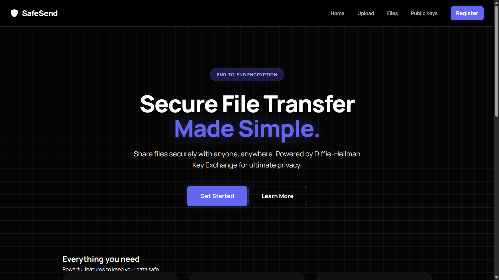
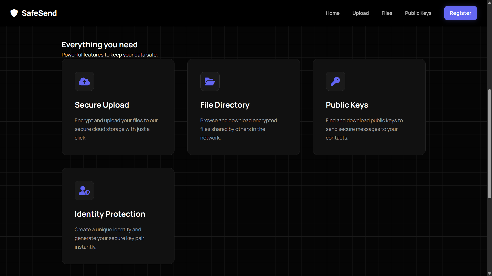
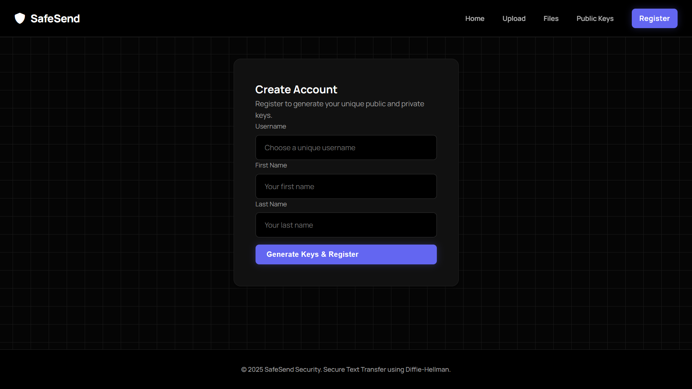
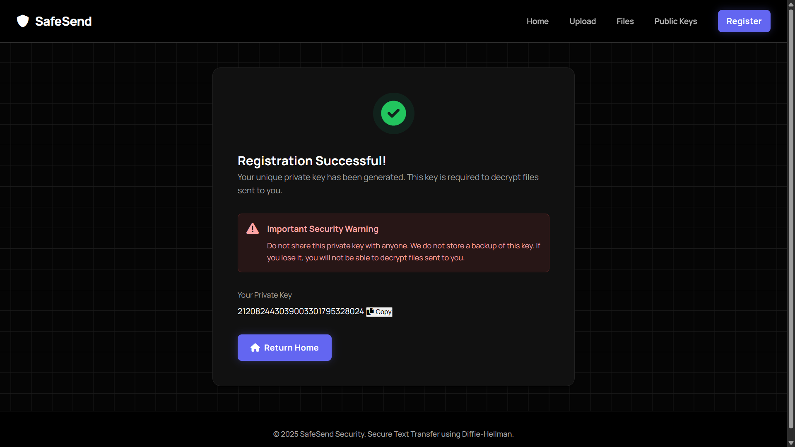
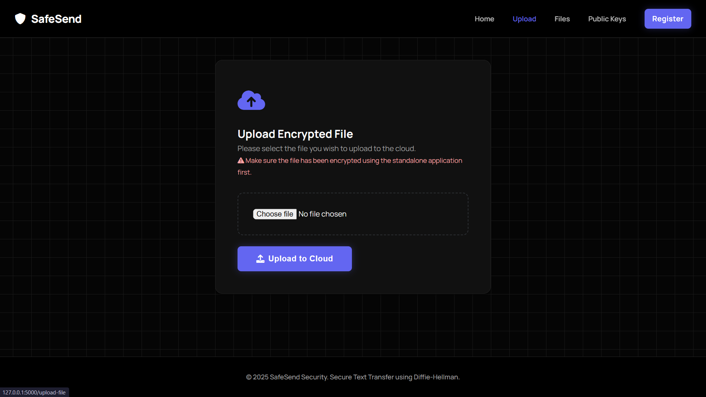
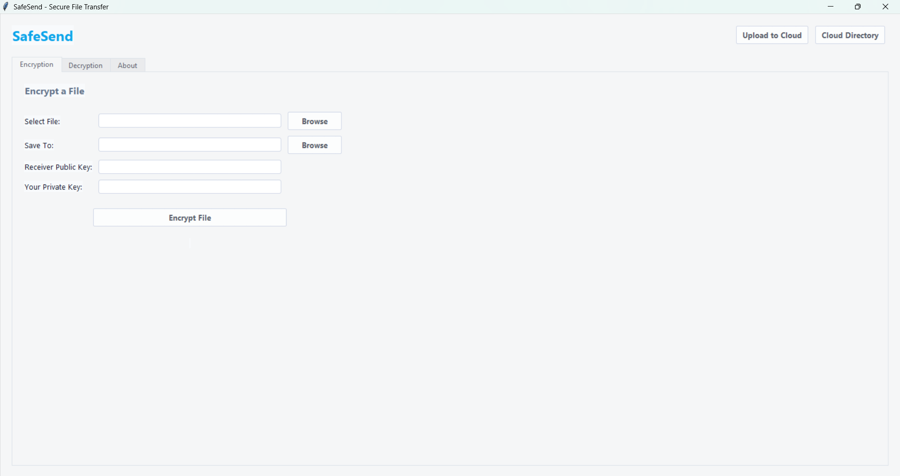

# SafeSend 🔐

**SafeSend** is a secure file transfer system that enables encrypted file sharing using the **Diffie-Hellman Key Exchange** protocol and **AES encryption**. The project consists of a web application for cloud storage and a desktop application for local encryption/decryption.

## 📑 Table of Contents

- [Features](#-features)
- [Security Features](#-security-features)
- [Prerequisites](#-prerequisites)
- [Installation](#-installation)
- [Usage](#-usage)
    - [Running the Web Application](#running-the-web-application)
    - [Running the Desktop Application](#running-the-desktop-application)
- [How It Works](#-how-it-works)
- [Screenshots](#-screenshots)
- [Project Structure](#-project-structure)
- [Technologies Used](#-technologies-used)
- [Configuration](#️-configuration)
- [Troubleshooting](#-troubleshooting)
- [Author](#-author)

## 🌟 Features

### Web Application

- **User Registration**: Generate unique public/private key pairs
- **Cloud Storage**: Upload and store encrypted files
- **File Directory**: Browse and download encrypted files
- **Public Key Directory**: Access public keys of registered users
- **Modern UI**: High-contrast, professional dark theme

### Desktop Application

- **File Encryption**: Encrypt files using receiver's public key
- **File Decryption**: Decrypt files using sender's public key
- **Modern GUI**: Clean, tabbed interface with real-time status
- **Quick Access**: Direct links to web application features

## 🔒 Security Features

- **Diffie-Hellman Key Exchange**: Secure key generation and exchange
- **AES Encryption**: Industry-standard symmetric encryption
- **End-to-End Encryption**: Files are encrypted before upload
- **No Key Storage**: Private keys are never stored on the server

## 📋 Prerequisites

- Python 3.x
- pip (Python package manager)

## 🚀 Installation

1. **Clone the repository**

    ```bash
    git clone https://github.com/jannat-miftahul/SafeSend.git
    cd SafeSend
    ```

2. **Install dependencies**

    ```bash
    pip install flask pycryptodome secretsharing ttkthemes
    ```

    Or use the requirements file:

    ```bash
    pip install -r requirements.txt
    ```

## 🎯 Usage

### Running the Web Application

1. Start the Flask server:

    ```bash
    python src/web-application/app.py
    ```

2. Open your browser and navigate to:
    ```
    http://127.0.0.1:5000
    ```

### Running the Desktop Application

1. Launch the GUI application:

    ```bash
    python src/stand-alone-application/main.py
    ```

2. Use the tabs to:
    - **Encryption**: Encrypt files for sending
    - **Decryption**: Decrypt received files
    - **About**: View project information

## 📖 How It Works

1. **Register**: Create an account on the web app to generate your key pair
2. **Download Keys**: Get the receiver's public key from the web directory
3. **Encrypt**: Use the desktop app to encrypt your file with the receiver's public key
4. **Upload**: Upload the encrypted file to the cloud via web app
5. **Download**: Receiver downloads the encrypted file from the cloud
6. **Decrypt**: Receiver decrypts the file using their private key

## 📸 Screenshots

### Web Application

#### Homepage



#### Features Overview



#### User Registration



#### Private Key Display



#### File Upload



### Desktop Application

#### Encryption Interface



## 📁 Project Structure

```
SafeSend/
├── src/
│   ├── web-application/          # Flask web app for cloud storage
│   │   ├── app.py               # Main Flask application
│   │   ├── static/              # CSS and assets
│   │   └── templates/           # HTML templates
│   └── stand-alone-application/ # Desktop GUI app
│       ├── main.py              # Tkinter GUI application
│       └── safesend_core.py     # Core encryption logic
├── Screenshots/                  # Project screenshots
├── requirements.txt             # Python dependencies
└── README.md                    # Project documentation
```

## ⚡ Technologies Used

- **Backend**: Flask (Python)
- **Encryption**: PyCryptodome (AES), Custom Diffie-Hellman
- **Secret Sharing**: Shamir's Secret Sharing
- **Desktop GUI**: Tkinter with ttkthemes
- **Frontend**: HTML, CSS, JavaScript

## ⚙️ Configuration

### Changing the Web Server Port

Edit `src/web-application/app.py` (line ~170):

```python
app.run(debug=False, port=5000)  # Change 5000 to your preferred port
```

### Customizing File Storage Location

The files are stored in:

- **Encrypted Files**: `src/web-application/media/text-files/`
- **Public Keys**: `src/web-application/media/public-keys/`
- **Database**: `src/web-application/media/database/`

## 🐛 Troubleshooting

### Port Already in Use

```bash
# Kill the process using port 5000 (on Windows)
netstat -ano | findstr :5000
taskkill /PID <process_id> /F
```

### Module Not Found

```bash
pip install --upgrade flask pycryptodome secretsharing ttkthemes
```

### GUI Not Opening

Ensure tkinter is installed (usually comes with Python):

```bash
python -m tkinter
```

## 👤 Author

**Miftahul Jannat**

- GitHub: [@jannat-miftahul](https://github.com/jannat-miftahul)
- LinkedIn: [Miftahul Jannat](https://in.linkedin.com/in/miftahuljannatofficial)

---
